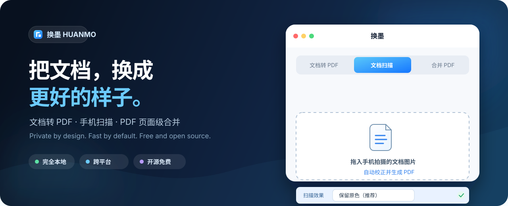

<p align="center">
  
</p>

<p align="center">
  <a href="README_EN.md">English</a> · <strong>简体中文</strong>
</p>

<p align="center">
  <a href="https://github.com/Forwindreach/HuanMo/releases/latest"></a>
  <a href="https://github.com/Forwindreach/HuanMo/actions/workflows/quality.yml"></a>
  <a href="LICENSE"></a>
  
  
</p>

<p align="center">
  <strong>免费、开源、完全本地运行的文档处理工具。</strong><br>
  不上传文件，不需要账号，把常用的 PDF 工作流留在自己的电脑上。
</p>

<p align="center">
  <a href="https://github.com/Forwindreach/HuanMo/releases/latest/download/HuanMo-macOS.zip"><strong>下载 macOS 版</strong></a>
  &nbsp;&nbsp;·&nbsp;&nbsp;
  <a href="https://github.com/Forwindreach/HuanMo/releases/latest/download/HuanMo.exe"><strong>下载 Windows 版</strong></a>
  &nbsp;&nbsp;·&nbsp;&nbsp;
  <a href="https://github.com/Forwindreach/HuanMo/releases/latest">所有版本</a>
</p>

---

## 为什么选择换墨？

很多在线 PDF 工具要求上传私人文件，专业软件又常常笨重、昂贵。换墨提供另一种选择：体积克制、界面简单、数据只在本地流转。

| 文档转 PDF | 文档扫描 | PDF 页面级合并 |
|:---:|:---:|:---:|
| Markdown、TXT、Word 一键转换 | 自动识别纸张、校正透视与方向 | 预览、删页、拖拽重排后合并 |
| 中文字体自动适配 | 原色、彩色增强、黑白三种效果 | 支持精确到单页的自由组合 |
| 批量处理多个文件 | 支持 HEIC 等手机照片格式 | 加密 PDF 会被安全拒绝 |

### 设计原则

- **隐私优先**：转换、扫描和合并全部在本机完成，没有文件上传。
- **打开即用**：普通用户直接下载应用，无需配置 Python 环境。
- **所见即所得**：扫描与合并均提供页面预览，导出前即可确认顺序和效果。
- **跨平台**：为 macOS 与 Windows 自动构建独立应用。
- **开放透明**：MIT 许可，核心实现集中、易于审阅和二次开发。

## 快速开始

### macOS

1. 下载 [`HuanMo-macOS.zip`](https://github.com/Forwindreach/HuanMo/releases/latest/download/HuanMo-macOS.zip)。
2. 解压并打开 `HuanMo.app`。
3. 浏览器会自动打开本地界面，选择需要的功能即可。

> 首次打开若出现“无法验证开发者”，请右键 `HuanMo.app` → **打开** → 再次确认。换墨目前未进行 Apple 代码签名。

### Windows

1. 下载 [`HuanMo.exe`](https://github.com/Forwindreach/HuanMo/releases/latest/download/HuanMo.exe)。
2. 双击运行，浏览器会自动打开本地界面。

> 若 SmartScreen 出现提示，请选择 **更多信息** → **仍要运行**。发布包由 GitHub Actions 从公开源码自动构建。

## 三个核心工作流

<details open>
<summary><strong>文档转 PDF</strong></summary>
<br>

拖入 `.md`、`.txt` 或 `.docx` 文件，选择输出目录后开始转换。Markdown 支持标题、表格、代码块与引用；Word 支持常见文本样式和简单表格。

</details>

<details>
<summary><strong>手机文档扫描</strong></summary>
<br>

导入一张或多张手机照片，换墨会尝试识别纸张边缘并校正透视。你可以选择：

- **保留原色（推荐）**：尽量保持照片原貌，适合证件、彩色材料和图片。
- **彩色增强**：只增强亮度与文字边缘，保留彩色印章和标记。
- **黑白扫描**：生成高对比度扫描效果，适合纯文字材料。

处理后可预览、旋转、删除或拖拽排序，最终导出为一个 A4 PDF。

</details>

<details>
<summary><strong>PDF 页面级合并</strong></summary>
<br>

同时添加多个 PDF 后，换墨会生成页面缩略图。你可以删除不需要的页面、跨文件拖拽排序，再按当前顺序生成新的 PDF。

</details>

## 支持格式

| 输入类型 | 扩展名 | 能力 |
|---|---|---|
| Markdown | `.md` `.markdown` | 标题、列表、表格、代码块、引用 |
| 纯文本 | `.txt` `.text` | 保留换行与空白 |
| Word | `.docx` | 标题、粗体、斜体、简单表格 |
| 图片 | `.jpg` `.jpeg` `.png` `.webp` `.bmp` `.tif` `.tiff` `.heic` `.heif` | 裁边、透视校正、效果增强、排序 |
| PDF | `.pdf` | 页面预览、删除、重排、合并 |

## 隐私与安全

```text
你的文件  →  本机 127.0.0.1 处理  →  你指定的输出目录
                 │
                 └── 不上传、不留存到云端、不需要账号
```

换墨只监听本机回环地址 `127.0.0.1:5199`。临时预览保存在系统临时目录，原始文档不会发送给项目作者或任何第三方服务。有关漏洞报告方式，请参阅 [SECURITY.md](SECURITY.md)。

## 从源码运行

需要 Python 3.9 或更高版本：

```bash
git clone https://github.com/Forwindreach/HuanMo.git
cd HuanMo
python3 -m pip install -r md2pdf_app/requirements.txt
python3 md2pdf_app/app.py
```

也可以在 macOS 双击 `md2pdf_app/启动.command`，或在 Windows 双击 `md2pdf_app/启动.bat`。应用启动后访问 <http://127.0.0.1:5199>。

## 项目结构

```text
HuanMo/
├── md2pdf_app/
│   ├── app.py              # Flask 界面与全部文档处理逻辑
│   ├── requirements.txt    # 运行依赖
│   ├── 启动.command         # macOS 源码启动器
│   └── 启动.bat             # Windows 源码启动器
├── tests/                  # 图像扫描回归测试
├── build_app.py            # PyInstaller 打包入口
└── .github/workflows/      # 质量检查与跨平台发布
```

## 路线图

- [x] Markdown / TXT / DOCX 转 PDF
- [x] PDF 页面预览、删页、排序与合并
- [x] 手机照片透视校正与三种扫描效果
- [x] HEIC / HEIF 支持
- [ ] 扫描区域手动微调
- [ ] OCR 文本识别与可搜索 PDF
- [ ] 更多导出纸张尺寸与页边距选项
- [ ] Linux 独立发布包

路线图不代表交付承诺。欢迎在 [Discussions](https://github.com/Forwindreach/HuanMo/discussions) 或 Issues 中提出使用场景。

## 参与贡献

欢迎提交 Bug、功能建议、文档改进和代码贡献。开始之前请阅读 [贡献指南](CONTRIBUTING.md) 与 [行为准则](CODE_OF_CONDUCT.md)。

- 发现问题：[提交 Bug](https://github.com/Forwindreach/HuanMo/issues/new?template=bug_report.yml)
- 功能建议：[提出想法](https://github.com/Forwindreach/HuanMo/issues/new?template=feature_request.yml)
- 版本记录：[CHANGELOG.md](CHANGELOG.md)

## 常见问题

<details>
<summary><strong>为什么浏览器里还是旧界面？</strong></summary>
<br>
旧版应用可能仍占用 `5199` 端口。请彻底退出旧版换墨，再打开新版本；必要时强制刷新浏览器页面。
</details>

<details>
<summary><strong>为什么 Word 转换后与原文不完全一致？</strong></summary>
<br>
当前版本面向常见文本结构，不支持复杂合并单元格、浮动图片和精细分页。对排版保真要求较高时，建议先由 Word 导出 PDF，再使用换墨合并。
</details>

<details>
<summary><strong>扫描时没有自动裁边怎么办？</strong></summary>
<br>
为了避免把页面内部的表格或色块误判为纸张，换墨只会在边缘置信度足够高时自动裁边。拍摄时尽量让纸张占据画面主体，并与背景形成明显对比。
</details>

## License

基于 [MIT License](LICENSE) 开源。你可以自由使用、学习、修改和分发。

<p align="center">
  如果换墨帮到了你，欢迎点一个 ⭐ Star，让更多人发现它。
</p>
